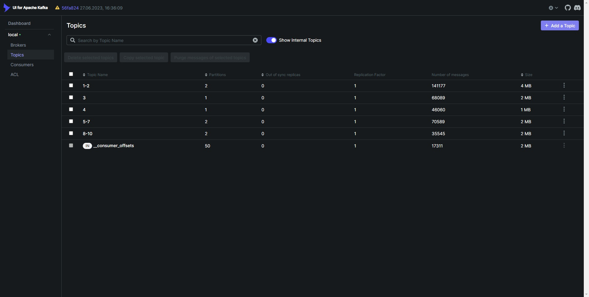
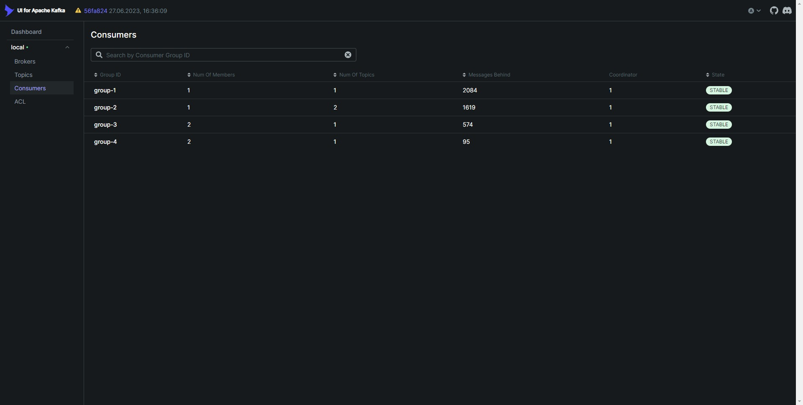

# Kafka Producer & Consumer

example of using Apache Kafka to send and receive messages

## :small_blue_diamond: Topics

topics are configured in [properties](./kafka-producer/src/main/resources/application.yaml#L22) : name, partitions and replicas

the key and value of the message are generated randomly

in this case there are 5 topics:

- `1-2` : keys=[1;2], values=[-50x10<sup>3</sup> ; -10x10<sup>3</sup>], partitions=[2]
- `3` : keys=[3], values=[-5x10<sup>3</sup> ; -1], partitions=[1]
- `4` : keys=[4], values=[0; 50x10<sup>3</sup>], partitions=[1]
- `5-7` : keys=[5;7], values=[70x10<sup>3</sup> ; 100x10<sup>3</sup>], partitions=[2]
- `8-10` : keys=[8;10], values=[250x10<sup>3</sup> ; 500x10<sup>3</sup>], partitions=[2]

## :small_blue_diamond: Producer

messages are sent by schedulers that are configured in [properties](./kafka-producer/src/main/resources/application.yaml#L40) :

- `initial-delay` - delay before the first invocation
- `fixed-rate` - period between invocations
- `topic` - topic name to send message
- `min\max key & value` - the boundaries of key and value in which they will be generated

in this case 5 schedulers are defined - one for each topic

## :small_blue_diamond: Consumer

consumers are configured in [properties](./kafka-consumer/src/main/resources/application.yaml#L17) :

- `group-id` - ID of the consumer group for collective consumption of messages from the same topics
- `topics` - the names of the topics that the group of consumers is listening to
- `concurrency` - number of listeners in the group

in this case 4 consumer groups are defined :

- `group-1` : 1 consumer for the topic `1-2`
- `group-2` : 1 consumer for the topics `3` and `4`
- `group-3` : 2 consumers for the topic `5-7`
- `group-4` : 2 consumers for the topic `8-10`

## :small_blue_diamond: Docker Compose

build and run app with docker compose

```
docker-compose up -d
```

6 containers must be started:

- producer : port `8085`

- consumer : port `8086`

- frontend : port `8088`

- zookeeper : port `22181`

- kafka broker : port `29092`

- kafka-ui : web UI for managing Apache Kafka clusters http://localhost:8090/




after starting the containers you can monitor the change in the number of messages by the link : http://localhost:8088


